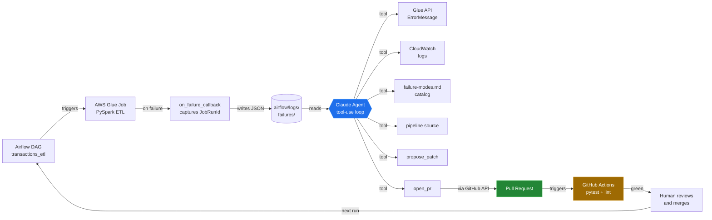

# spark-self-heal

[](https://github.com/CristianCaro-portfolio/spark-self-heal/actions/workflows/ci.yml)

A self-healing data pipeline on AWS. When the pipeline fails, an AI agent
reads the logs, diagnoses the failure against a documented catalog,
writes a code patch, and opens a Pull Request on GitHub. A human reviews
and merges. The next run is green.

> The agent runs in **propose** mode by default — it never merges itself.
> Human-in-the-loop by design (see [ADR-002](docs/adr/002-agent-autonomy-scope.md)).

## What it does

- **Ingests** synthetic fintech transactions (JSONL) from S3.
- **Validates** them in a PySpark Glue Job with an explicit schema, a
  schema-drift probe, a non-null guard, currency allow-list, and
  timestamp parsing.
- **Writes** partitioned Parquet to a silver bucket queryable via Athena.
- **On failure**, an Airflow `on_failure_callback` captures the Glue
  JobRunId and exception into a structured JSON event.
- **An agent** (Claude + tool use) reads that event, queries Glue and
  CloudWatch, matches the failure to one of the six documented modes in
  [`docs/failure-modes.md`](docs/failure-modes.md), generates a patched
  version of the pipeline, and opens a Pull Request via the GitHub API.
- **GitHub Actions** runs `pytest + ruff + py_compile` on the PR.
- **A human** reviews the diff and merges. The next DAG run succeeds.

## How it works



## Stack

- **AWS**: S3, Glue (Catalog + Jobs), Athena, CloudWatch Logs, IAM
- **Orchestration**: Apache Airflow self-hosted via `docker-compose`
- **Infrastructure as Code**: Terraform (`default_tags`, single region)
- **Pipeline**: PySpark on AWS Glue 4.0 (Spark 3.3.x)
- **Agent**: Python + Anthropic Claude API + tool-use loop (7 tools)
- **CI**: GitHub Actions — pytest, py_compile, ruff
- **Tests**: pytest with a shared `SparkSession` fixture, ANSI mode
  pinned to mirror the Glue runtime semantics

## Domain

Fintech payments. The pipeline ingests JSON transaction events,
validates them, and writes partitioned Parquet to a silver zone
queryable via Athena.

Six failure modes are deliberately seeded into the broken datasets
(schema drift, invalid currency codes, negative amounts, malformed
timestamps, duplicate IDs, nulls on required fields). See
[`docs/failure-modes.md`](docs/failure-modes.md) for the catalog used
as the agent's grounding data.

## Repository layout

```
.
├── .github/workflows/      # CI pipeline (pytest + ruff + py_compile)
├── docs/
│   ├── adr/                # Architecture Decision Records
│   ├── architecture/       # (reserved)
│   └── failure-modes.md    # Catalog of injected failures (FM-01..FM-06)
├── terraform/              # S3, Glue Catalog, IAM, Glue Job, outputs
├── pipelines/jobs/         # PySpark scripts executed by AWS Glue
├── airflow/
│   ├── dags/               # transactions_etl DAG with GlueJobOperator
│   └── logs/failures/      # JSON events captured by on_failure_callback
├── agent/
│   ├── tools/              # 7 tools: failure_record, glue_metadata,
│   │                       #          glue_logs, catalog, pipeline_code,
│   │                       #          propose_patch, open_pr
│   ├── patches/            # Historical patches generated by the agent
│   ├── llm.py              # Tool-use loop with rate-limit retry
│   ├── prompts.py          # System prompts (diagnose / full three-phase)
│   └── diagnose.py         # High-level entry point
├── scripts/
│   ├── generate_dataset.py # Synthetic fintech data with 6 failure modes
│   ├── run_agent.py        # CLI entry point for the agent
│   └── test_tools.py       # Smoke test for the agent tools (no LLM)
├── tests/                  # pytest suite for the pipeline schema + logic
├── docker-compose.yml      # Local Airflow stack (Postgres + webserver + scheduler)
├── requirements-dev.txt    # PySpark 3.5.3 + pytest (pinned for Glue parity)
├── ruff.toml               # Lint config (advisory in CI)
└── .env.example            # Copy to .env and fill in secrets
```

## Quick start (local)

### 1. Python environment

```bash
python3 -m venv .venv && source .venv/bin/activate
pip install -r requirements-dev.txt
pip install boto3 anthropic requests python-dotenv faker
```

### 2. Synthetic dataset

```bash
python scripts/generate_dataset.py
```

This writes a clean variant plus six broken variants under
`data/sample/` and `data/broken/`, fully reproducible with a fixed seed.

### 3. AWS resources (Terraform)

> Read [ADR-003](docs/adr/003-cost-guardrails.md) **before** running
> `terraform apply`. Budget: $10/month, single region, mandatory tags.

```bash
cd terraform
terraform init
terraform apply
```

### 4. Airflow

```bash
docker compose up -d
# UI at http://localhost:8080  (user: airflow, password: airflow)
```

### 5. Tests

```bash
pytest tests/ -v
```

### 6. Agent

Configure `.env` from `.env.example` (Anthropic + GitHub fine-grained
token + AWS profile). Then, given a failure record under
`airflow/logs/failures/`:

```bash
# Diagnose + propose patch + open PR (default)
python -m scripts.run_agent

# Diagnose only, no patch and no PR
python -m scripts.run_agent --diagnose-only

# Target a specific failure record by filename
python -m scripts.run_agent <filename>.json
```

Cost per full run: roughly **$0.20 USD** (Claude Sonnet, 5-7 tool-use
iterations). Token usage is bounded by reading the end of CloudWatch
streams and preferring the Glue API `ErrorMessage` over raw logs.

## Architecture decisions

See [`docs/adr/`](docs/adr/) for the full ADR log:

- **[ADR-001](docs/adr/001-aws-real-instead-of-localstack.md)**: Real
  AWS account instead of LocalStack — Glue and Athena coverage outweighs
  emulator convenience.
- **[ADR-002](docs/adr/002-agent-autonomy-scope.md)**: Three agent
  autonomy modes (`observe` / `propose` / `apply`) controlled by
  `AGENT_MODE`. Default is `propose` — the agent never merges itself.
- **[ADR-003](docs/adr/003-cost-guardrails.md)**: Non-negotiable cost
  guardrails — $10/month budget with alerts, mandatory `default_tags`,
  `terraform destroy` ritual at session end, single region, MFA-enforced
  IAM user.

## Cost discipline

- AWS Budget alarms at 80% and 100% (actual + forecasted).
- Every Terraform-managed resource carries
  `Project=spark-self-heal, Environment=dev, Owner=cristian` via
  `default_tags`.
- `.gitignore` blocks `*.tfstate`, `*.tfvars`, `.env`, and credential
  CSVs.
- The agent reads the **end** of CloudWatch streams with truncation, and
  prefers the Glue API `ErrorMessage` field, to keep token spend
  predictable.

## License

MIT
